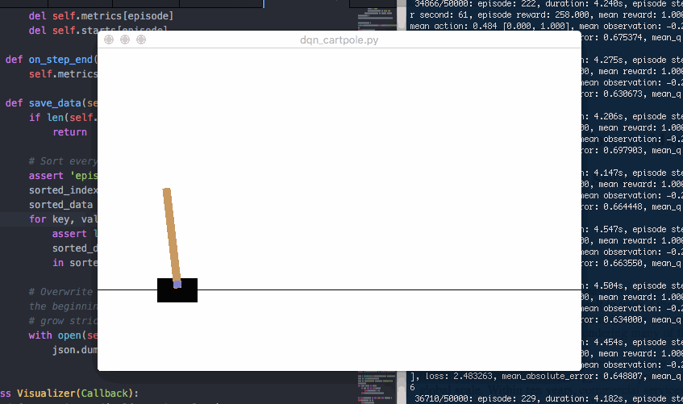
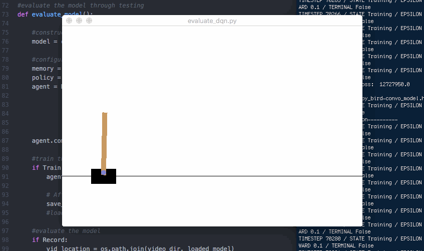

[Back to Arcade.](https://mgallow.github.io/Arcade/)

# Cart-Pole

## Introduction

### Files:

- blah
- blah

### Requirements

**Software**:
- Python 2.7, 3.5
- Keras is available via pip or [Github](https://github.com/fchollet/keras)
- blah

## Acknowledgements

[Back to Arcade.](https://mgallow.github.io/Arcade/)
